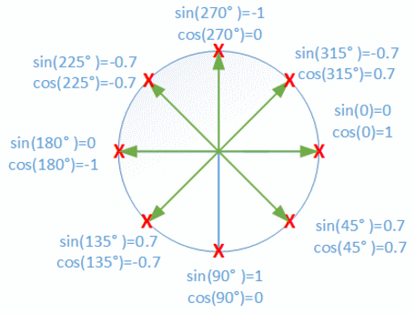

# 11 &mdash; Basic Animation of DOM Elements
> using `requestAnimationFrame` to animate DOM elements

## Description

By building on what's been explained in the [Positioning DOM Elements](./10-positioning-elems/) you can animate elements in an HTML page.

In the example, we animate an image that is initially centered on the page and given a `style="position: relative"` and use the method `requestAnimationFrame` to perform such task.
This function receives a single argument `callback` which must be the function to call for the next *repaint* operation. This function must receive a single param, a `DOMHighResTimeStamp` which indicates the current time.

 The image will be animated in a circular-like way.

The animation logic is as follows:
+ Locate the `` in the document.
+ initialize the variable that collects the last time the animation function run, the angle and the speed we'll use to animate
+ In the function, we compute the angle as `angle = (time - lastTime) * speed`;
+ Then we compute the `top` and `left` properties using the `Math.sin` and `Math.cos` respectively.

```javascript
const img = document.querySelector("img");
let angle = 0;
let lastTime = null;

let speed = 0.001;

function animate(time) {
  if (lastTime !== null) {
    angle += (time - lastTime) * speed;
  }
  lastTime = time;
  img.style.top = (Math.sin(angle) * 150) + "px";
  img.style.left = (Math.cos(angle) * 100) + "px";
  requestAnimationFrame(animate);
}

requestAnimationFrame(animate);
```

**Note: On using `sin` and `cos`**
`Math.cos` and `Math.sin` are useful for finding points that lie on a circle around a center point *(0, 0)* with a radius of one unit.
Both functions interpret their argument as the position on this circle, with zero denoting the point on the far right of the circle, going clockwise until reaching 2π, which would take us to the initial position.

`Math.cos` will give you the x-coordinate (`left`) and `Math.sin` the y-coordinate (`top`). Also note that we don't need to compute the modulus 2π as the andle *a + 2π* is the same as the angle *a*.

