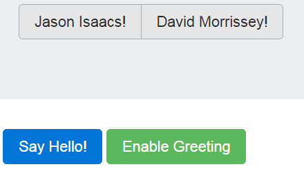

# e02 &mdash; Grokking State and Event Handling
> an involved example using `addEventListener` and `removeEventListener` intertwined with page state management using attributes and classes.

## Description
In the example, we have a simple layout with 2 on/off buttons and two clickable buttons.

The state of the *on/off* buttons is controlled via the classes that are assigned to them, as well as element attributes such as the `aria-pressed`. The former is controlled using the `node.classList` property which features really handy methods such as `toggle`, `contains` (see https://developer.mozilla.org/en-US/docs/Web/API/Element/classList for further details); the attributes are set/get using `setAttribute` and `getAttribute` methods.

The button *Enable/Disable Greeting* trigger an `addEventListener` or `removeEventListener` respectively, and the *Say Hello!* button will trigger an action only if the event listener is registered.